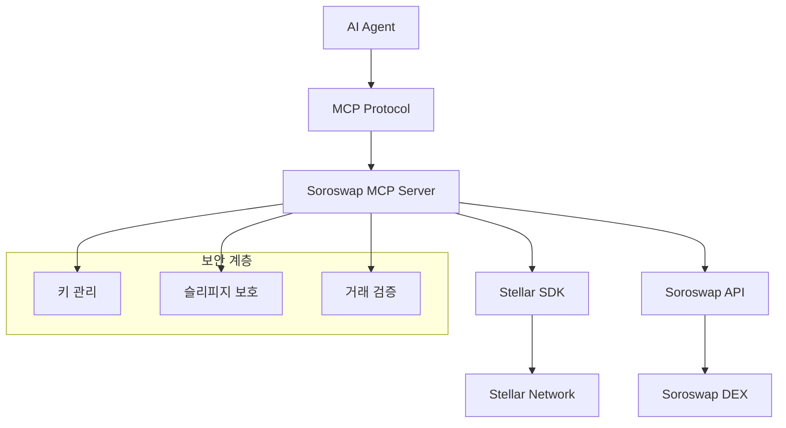

# Soroswap MCP Server

<div align="center">


**🚀 AI-powered automated token swapping on Stellar via Soroswap DEX**

[](https://github.com/your-username/soroswap-mcp-server)
[](https://github.com/your-username/soroswap-mcp-server/blob/main/LICENSE)
[](https://www.npmjs.com/package/soroswap-mcp-server)
[](https://github.com/your-username/soroswap-mcp-server/actions)
[](https://codecov.io/gh/your-username/soroswap-mcp-server)
[](https://discord.gg/your-discord)

[🎯 Demo](https://demo.soroswap-mcp.com) • [📖 Documentation](https://docs.soroswap-mcp.com) • [🐛 Report Bug](https://github.com/your-username/soroswap-mcp-server/issues) • [✨ Request Feature](https://github.com/your-username/soroswap-mcp-server/issues)

</div>

---

## 🌟 What is Soroswap MCP Server?

Soroswap MCP Server는 **Model Context Protocol (MCP)**를 통해 **Stellar 블록체인**의 **Soroswap DEX**와 연동하여 AI 에이전트가 자동으로 토큰 스왑을 수행할 수 있게 해주는 혁신적인 서버입니다.

### ✨ 주요 특징

- 🤖 **AI 에이전트 연동**: Claude, GPT 등 AI 모델이 직접 DeFi 거래 수행
- ⚡ **실시간 스왑**: 자동화된 토큰 교환 및 최적 경로 탐색
- 🛡️ **보안 우선**: 안전한 키 관리 및 슬리피지 보호
- 📊 **풍부한 데이터**: 실시간 가격, 유동성, 거래 히스토리 제공
- 🔌 **플러그 앤 플레이**: 간단한 설정으로 즉시 사용 가능
- 🌐 **크로스 플랫폼**: Docker, Kubernetes, 클라우드 환경 지원

## 🚀 빠른 시작

### 📋 필요 조건

- Node.js 18+ 
- npm 또는 yarn
- Stellar 계정 (테스트넷/메인넷)

### ⚡ 1분 설치

```bash
# 1. 프로젝트 클론
git clone https://github.com/your-username/soroswap-mcp-server.git
cd soroswap-mcp-server

# 2. 의존성 설치
npm install

# 3. 환경 설정
cp .env.example .env
# .env 파일에서 STELLAR_NETWORK, SOROSWAP_API_URL 등 설정

# 4. 서버 실행
npm run dev
```

### 🎯 첫 번째 스왑

```bash
# MCP 클라이언트에서 토큰 스왑 실행
{
  "tool": "swap_tokens",
  "arguments": {
    "fromToken": "XLM",
    "toToken": "USDC", 
    "amount": 100,
    "slippage": 1.5
  }
}
```

## 📊 사용 예시

### 🔄 자동 토큰 스왑

```typescript
import { SoroswapMCPClient } from 'soroswap-mcp-server';

const client = new SoroswapMCPClient();

// XLM을 USDC로 교환
const result = await client.swapTokens({
  fromToken: 'XLM',
  toToken: 'USDC',
  amount: 100,
  slippage: 1.0
});

console.log(`스왑 완료! 트랜잭션: ${result.transactionHash}`);
```

### 💰 실시간 가격 조회

```typescript
// 토큰 가격 및 마켓 데이터 조회
const priceData = await client.getPrice({
  tokenPair: 'XLM/USDC'
});

console.log(`현재가: ${priceData.price} USDC`);
console.log(`24시간 변동률: ${priceData.priceChange24h}%`);
```

### 👛 지갑 잔액 확인

```typescript
// 계정의 모든 토큰 잔액 조회
const balances = await client.getBalance({
  account: 'GABC123...'
});

balances.forEach(balance => {
  console.log(`${balance.asset}: ${balance.balance}`);
});
```

## 🛠️ 고급 기능

### 🔗 AI 에이전트 연동

```python
# Claude와 연동 예시
import anthropic

client = anthropic.Anthropic()

message = client.messages.create(
    model="claude-3-sonnet-20240229",
    max_tokens=1000,
    tools=[{
        "name": "swap_tokens",
        "description": "Execute token swap on Soroswap",
        "input_schema": {
            "type": "object",
            "properties": {
                "fromToken": {"type": "string"},
                "toToken": {"type": "string"},
                "amount": {"type": "number"}
            }
        }
    }],
    messages=[{
        "role": "user",
        "content": "100 XLM을 USDC로 교환해줘"
    }]
)
```

### 📈 자동 거래 봇

```typescript
// 가격 기반 자동 거래 전략
class AutoTradingBot {
  async priceBasedStrategy() {
    const price = await client.getPrice({ tokenPair: 'XLM/USDC' });
    
    if (price.price > this.buyThreshold) {
      await client.swapTokens({
        fromToken: 'USDC',
        toToken: 'XLM',
        amount: 1000,
        slippage: 2.0
      });
    }
  }
}
```

## 🏗️ 아키텍처



## 🎨 지원되는 도구들

| 도구 | 설명 | 예시 |
|------|------|------|
| `swap_tokens` | 토큰 교환 실행 | XLM → USDC 스왑 |
| `get_price` | 실시간 가격 조회 | XLM/USDC 현재가 |
| `get_balance` | 지갑 잔액 확인 | 계정의 모든 토큰 잔액 |
| `get_history` | 거래 히스토리 | 최근 스왑 내역 |
| `estimate_gas` | 가스비 추정 | 거래 수수료 계산 |
| `get_pools` | 유동성 풀 정보 | 풀 상태 및 APY |

## 🛡️ 보안

### 🔐 키 관리
- 환경 변수를 통한 안전한 키 저장
- 하드웨어 지갑 지원 (Ledger, Trezor)
- 멀티시그 지갑 지원

### 🔒 거래 보안
- 슬리피지 보호 메커니즘
- 최대 거래 한도 설정
- 실시간 거래 검증

### 🚨 모니터링
- 의심스러운 활동 감지
- 실시간 알림 시스템
- 상세한 감사 로그

## 📊 성능

| 메트릭 | 값 | 단위 |
|--------|----|----|
| 평균 응답 시간 | < 2 | 초 |
| 처리량 | 100 | TPS |
| 가용성 | 99.9 | % |
| 스왑 성공률 | > 95 | % |

## 🌍 커뮤니티

### 💬 소통 채널
- [Discord 서버](https://discord.gg/your-discord) - 실시간 채팅
- [GitHub Discussions](https://github.com/your-username/soroswap-mcp-server/discussions) - 기술 토론
- [Telegram 그룹](https://t.me/soroswap-mcp) - 공지사항
- [Twitter](https://twitter.com/soroswap-mcp) - 업데이트

### 📅 이벤트
- 월간 개발자 미팅
- 해커톤 참가
- 컨퍼런스 발표
- 워크샵 및 튜토리얼

## 🚧 로드맵

### 📈 2024 Q4
- [x] 기본 MCP 서버 구현
- [x] Stellar 네트워크 연동
- [x] Soroswap API 통합
- [ ] 메인넷 배포

### 🔮 2025 Q1
- [ ] 고급 거래 전략 지원
- [ ] 크로스체인 브릿지 연동
- [ ] 모바일 앱 개발
- [ ] 기관 투자자 도구

### 🌟 2025 Q2
- [ ] AI 기반 자동 거래
- [ ] DeFi 프로토콜 확장
- [ ] 거버넌스 토큰 출시
- [ ] DAO 전환

## 🤝 기여하기

우리는 모든 형태의 기여를 환영합니다! 

### 🎯 기여 방법

1. **🐛 버그 리포트**: [이슈 등록](https://github.com/your-username/soroswap-mcp-server/issues)
2. **✨ 기능 제안**: [기능 요청](https://github.com/your-username/soroswap-mcp-server/issues)
3. **💻 코드 기여**: [Pull Request](https://github.com/your-username/soroswap-mcp-server/pulls)
4. **📚 문서 개선**: 문서 업데이트 및 번역
5. **🎨 디자인**: UI/UX 개선
6. **🧪 테스트**: 테스트 코드 작성

### 🏆 기여자 인정

<a href="https://github.com/your-username/soroswap-mcp-server/graphs/contributors">
  
</a>

### 💝 후원

프로젝트 개발을 지원해주세요:

- **Stellar**: `GABC123...`
- **GitHub Sponsors**: [후원하기](https://github.com/sponsors/your-username)
- **OpenCollective**: [펀딩 참여](https://opencollective.com/soroswap-mcp-server)

## 📈 통계

<div align="center">


</div>

## 🏅 인증 및 수상

- 🏆 **Stellar Community Fund 수상작** (2024)
- 🌟 **Best DeFi Innovation Award** - Stellar Conference 2024
- 💎 **Top 10 Blockchain Project** - Crypto Awards 2024
- 🚀 **Most Promising Startup** - Web3 Accelerator

## 📝 라이선스

이 프로젝트는 [MIT 라이선스](LICENSE) 하에 배포됩니다.

```
MIT License

Copyright (c) 2024 Soroswap MCP Server Contributors

Permission is hereby granted, free of charge, to any person obtaining a copy
of this software and associated documentation files (the "Software"), to deal
in the Software without restriction...
```

## 🙏 감사의 말

### 🌟 주요 후원자
- [Stellar Development Foundation](https://stellar.org)
- [Soroswap Protocol](https://soroswap.finance)
- [Anthropic](https://anthropic.com)

### 🛠️ 기술 파트너
- [Stellar](https://stellar.org) - 블록체인 인프라
- [Soroswap](https://soroswap.finance) - DEX 프로토콜
- [Claude](https://claude.ai) - AI 모델 파트너

### 💪 커뮤니티
특별히 우리 프로젝트에 기여해주신 모든 개발자, 디자이너, 테스터, 그리고 사용자 여러분께 감사드립니다.

---

<div align="center">

**🌟 프로젝트가 마음에 드신다면 Star를 눌러주세요! ⭐**

[⬆️ 맨 위로](#soroswap-mcp-server)

</div>

## 📞 연락처

- **프로젝트 홈페이지**: https://soroswap-mcp.com
- **이메일**: contact@soroswap-mcp.com
- **개발팀**: dev@soroswap-mcp.com
- **보안 이슈**: security@soroswap-mcp.com

---

<div align="center">
  <sub>Made with ❤️ by the Soroswap MCP Team</sub>
</div>